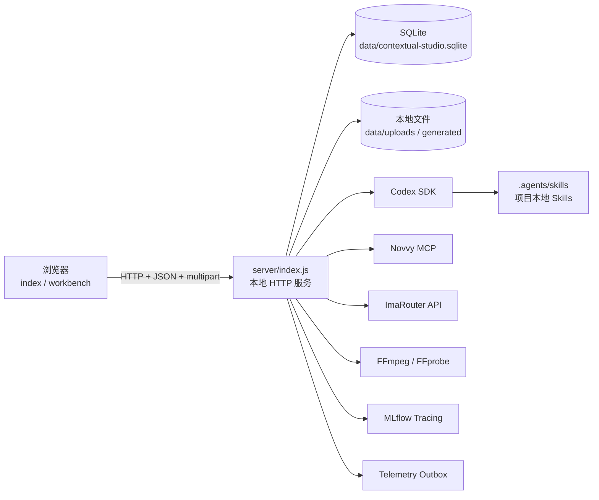
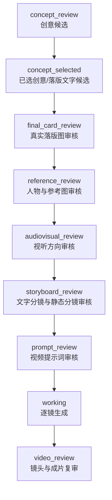

# Contextual Studio 代码全景说明

> 本文基于 2026-08-31 的仓库代码整理，面向需要快速理解、维护或继续开发本项目的工程人员。它描述的是当前本地版实现；云端迁移设想请另见 `TODO.md`。

## 1. 项目定位

Contextual Studio 是一个把“短剧理解、游戏理解、广告创意、图片资产、视频分镜、逐镜生成、成片确认和落地页打包”串成一条人工审核流水线的本地 Web 工作台。

系统不是传统的前后端分离应用，而是一个本地单体：

- 浏览器端使用原生 HTML、CSS 和 JavaScript，没有 React/Vue，也没有前端构建步骤。
- Node.js HTTP 服务同时提供静态页面、JSON API、文件上传、媒体读取和后台任务调度。
- SQLite 保存分析结果、创意会话、结构化卡片、生成任务、采集 outbox 等业务事实。
- Codex SDK 负责短剧视觉分析、游戏商品分析和持续的创意会话。
- Novvy MCP 负责图片生成和一种视频生成路径；ImaRouter 提供另一种逐镜视频生成路径。
- FFmpeg/FFprobe 负责抽帧、媒体探测、转码和最终视频拼接。

## 2. 总体架构



主要设计原则是“模型给结构化建议，后端控制真实副作用”：Codex 可以产出创意卡片、文字方案和结构化工作区，但不能凭空宣称图片已经生成；付费图片和视频任务必须经过后端专用生成模块，得到真实 URL 后才写回消息卡片。

## 3. 目录与职责

| 路径 | 主要职责 |
| --- | --- |
| `public/index.html`、`public/app.js` | 短剧上传、游戏录入、分析历史、工作台创建入口 |
| `public/workbench.html`、`public/workbench.js` | 创意画布、聊天、候选卡、人物/分镜审核、资产区、视频复审 |
| `public/styles.css` | 两个页面共用的全部样式 |
| `server/index.js` | HTTP 服务入口、路由、上传与静态文件、后台任务触发、重启恢复 |
| `server/database.js` | SQLite 初始化、轻量迁移、查询与 API 序列化、资产编号解析 |
| `server/ai-analysis-api.js` | 查询远端短剧/App 解析、适配现有创意契约、刷新短期签名图片 |
| `server/analyzer.js` | 历史本地短剧分析实现；当前首页流程不再调用 |
| `server/game-analyzer.js` | 历史本地商店页分析实现；当前首页流程不再调用 |
| `server/creative-agent.js` | 单一 Codex thread 的多轮创意状态、结构化卡片与防幻觉校验 |
| `server/image-generator.js` | 落版图生成、修改、确认 |
| `server/character-generator.js` | 人物参考图生成、修改、确认参考图组 |
| `server/asset-generator.js` | 通用资产创建、附件登记、资产修改与软删除 |
| `server/audiovisual-direction.js` | 视听方向与导演参数确认 |
| `server/storyboard-generator.js` | 文字分镜解析、逐镜静态图生成/修改/重试/统一确认 |
| `server/storyboard-video-plan.js` | 从视频提示词卡解析稳定的逐镜任务契约 |
| `server/video-generator.js` | 通过 Novvy MCP 生成逐镜视频 |
| `server/imarouter-video-generator.js` | ImaRouter 提交、轮询、持久化任务和重启续跑 |
| `server/video-shot-review.js` | 逐镜确认、合成触发、最终视频确认 |
| `server/video-finalizer.js` | 下载逐镜结果、标准化、拼接、追加已确认落版图 |
| `server/video-quality-review.js` | 成片技术 QC、哈希和联络表信息 |
| `server/landing-page-packager.js` | 把确认成片、商店链接和产品信息打成 HTML5 ZIP |
| `server/novvy-mcp-client.js` | MCP 初始化、鉴权、工具调用与结果解包 |
| `server/creative-telemetry.js` | 本地 outbox、幂等事件、回补、远端批量发送 |
| `server/mlflow-tracing.js` | Codex、MCP、HTTP 调用 tracing 与敏感信息清洗 |
| `server/local-telemetry-server.js` | 独立的本地采集接收端，仅用于开发 |
| `config/production-profile.json` | 镜头数、时长、分辨率、供应商、审核阈值等生产约束 |
| `.agents/skills/` | 运行时依赖的项目本地 Skills、schema、参考规范和脚本 |

## 4. 启动与运行模型

`server/index.js` 是唯一应用入口。默认监听 `127.0.0.1:4180`，只绑定回环地址。`start_server.sh` 会检查 Node.js 24、npm、FFmpeg 和 FFprobe，然后执行 `npm start`；开发模式使用 Node 的 `--watch`。

应用启动时会：

1. 导入 `database.js`，创建 `data/`、数据库和必要表。
2. 创建上传、聊天附件和生成产物目录。
3. 启动 HTTP 服务。
4. 扫描仍处于 `working` 的创意会话。
5. 对已持久化的 ImaRouter 任务、部分图片任务和中断的创意阶段做恢复或安全回退。
6. 启动 telemetry outbox 定时发送器。

短剧与 App 解析是同步的远端只读查询；Codex 创意轮次、图片生成和视频生成主要通过“API 立即返回 202，进程内异步函数继续执行”的方式运行。后者适合本地单进程，但不是可靠队列；进程崩溃时只有代码明确覆盖的任务能恢复。

## 5. 核心业务流程

### 5.1 短剧解析

```text
AI Analysis API 短剧目录
  -> 用户选择已完成整剧解析的短剧 UUID
  -> 查询短剧详情（aiPlot + episodes + 签名图片）
  -> 保留远端原始分析
  -> 确定性投影为 novvy.video-analysis.v3
  -> 创建工作台时按 external_source_id 同步到本地 SQLite
```

适配层不会再调用模型补齐远端没有返回的字段。原始 `aiPlot`、分集 `aiSummary` 和 GCS 对象路径保留在 `remoteAnalysis`；现有创意读取器需要的 v3 节点只做确定性投影。人物代表帧和分集拼图使用稳定的本地代理路径，实际访问时重新查询详情，以获得未过期的签名 URL。

### 5.2 App 解析

首页调用产品目录接口，可把 `os` 和 `category` 原样传给远端过滤。选择产品后查询完整 `aiGameplay`、商店截图和创意拼图。创建工作台时按 `external_source_id` 更新或插入 `game_analyses`，保留原始玩法 JSON，并投影出旧创意流程需要的产品真实性、卖点、受众和市场传达字段。

### 5.3 创意工作台

创建工作台时必须选择一个已完成的 v3 短剧分析和一个已完成的游戏分析。服务创建 `creative_sessions`，随后异步启动首轮 Codex 创意匹配。

每个工作台只维护一个 Codex thread：首次调用 `startThread`，后续用数据库中的 `codex_thread_id` 恢复。每轮输入都包含短剧事实、游戏事实、当前 `workspace_json`、用户消息和可选视觉附件。

Codex 输出由 JSON Schema 限制为：

- `assistantMessage`：聊天文字。
- `assistantCards`：当前轮可交互卡片。
- `stage`：当前流程阶段。
- `workspace`：长期结构化工作区。
- `nextAction`：下一步提示。

`workspace` 保存连接论点、受众策略、情绪连续性、转化策略、候选创意、已选方案、已确认成果、生产状态、限制和未知项。`confirmedCards` 是长期成果档案；聊天消息卡则保留每一轮候选和版本历史。

### 5.4 人工审核状态机

典型主路径如下：



`working` 是互斥处理状态，避免大多数重复提交；`error` 表示 Codex 创意轮次失败。前端也会根据最新卡片推断展示阶段，以兼容部分历史数据。

关键人工闸门包括：

1. 用户选择创意后，才能准备落版图文字候选。
2. 用户明确选择一个候选后，后端才提交真实落版图生成。
3. 落版图确认后，才进入人物参考图。
4. 人物图组确认后，先确认视听方向，不能直接跳到分镜。
5. 选择文字分镜后先生成静态分镜图；全部确认后才生成视频提示词。
6. 视频按镜头生成，用户确认全部镜头后才合成。
7. 最终成片再次确认后，才允许打包落地页。

### 5.5 图片与资产

图片统一以 `creative_messages.cards_json` 中带真实 `previewUrl` 的视觉卡片为来源。`database.js` 顺序扫描消息，去重 URL，并动态分配稳定展示编号“图片 01、图片 02……”。短剧原始关键帧单独编号为“截图 01、截图 02……”。

用户可以在文字中引用这些编号；`resolveAssetReferences()` 会解析编号、校验是否存在，并把真实 URL 和元数据交给生成模块。删除图片并不删除原始消息或远端对象，而是在 `creative_asset_deletions` 中记录软删除。

图片生成都采用相似模式：

1. 校验会话阶段、目标卡和用户意见。
2. 写入一张 `generating` 卡并把会话设为 `working`。
3. 通过 Novvy MCP 创建 GPT Image 任务。
4. 每 5 秒查询，最长约 20 分钟。
5. 成功后用真实 URL 写入新版本卡；失败则保留旧版本并回到对应审核阶段。

### 5.6 分镜与视频

文字分镜最多拆为 3 镜。静态分镜图使用对应人物参考图、落版图和镜头描述生成；每张可以独立修改，不同卡片允许并行，但同一卡片会被锁定。

静态分镜统一确认后，Codex 产出 `contextual.storyboard-video.v1` 逐镜契约。每镜包含稳定 `shotId`、顺序、时长、中文审核稿和等义英文提交提示词。

视频有两条供应商路径：

- Novvy：通过 MCP 创建并轮询生成任务。
- ImaRouter：把本地参考图按需上传到 GCS，调用 Seedance 类接口，并把每镜任务 ID 写入 `creative_video_shots`；服务重启后从原任务续查，不重复提交。

所有镜头完成后，`video-finalizer.js` 下载并标准化视频，按顺序拼接，再追加已确认的静态落版图。成片会执行基础技术 QC，包括时长/分辨率探测、文件哈希和镜头联络表信息。最终文件通过 `/api/generated/videos/<name>` 提供范围请求播放。

### 5.7 HTML5 落地页打包

只有状态为 `confirmed` 且指向本地最终视频的 `video_prompt` 卡可以打包。打包器会：

- 验证游戏商店跳转地址。
- 尝试下载游戏 icon。
- 压缩/转码最终视频。
- 生成无外部框架的 `index.html` 和 `analytics.js`。
- 打成 ZIP 并写入 `creative_landing_packages`。

## 6. 数据模型

| 表 | 用途 | 关键关系/特点 |
| --- | --- | --- |
| `drama_analyses` | 视频元数据、状态、v3 分析 JSON | 原视频路径在本地文件系统 |
| `drama_screenshots` | 20 张关键帧 | JPEG BLOB；级联归属短剧分析 |
| `game_analyses` | 商店 URL、来源产品、分析 JSON | 保存 Codex thread id，但当前分析是单轮 |
| `creative_sessions` | 工作台主记录 | 关联短剧和游戏；保存 stage、workspace、Codex thread id |
| `creative_messages` | 对话、卡片和附件 | `cards_json`、`attachments_json` 由启动期轻量迁移补列 |
| `creative_asset_deletions` | 资产软删除 | 按 session + URL 唯一 |
| `creative_video_shots` | 逐镜视频任务 | 持久化 provider、版本、task id、结果和错误 |
| `creative_landing_packages` | 已打包 ZIP | 保存最终下载名、商店 URL 和 App 名称 |
| `creative_telemetry_runs` | 本地创意采集 run | 本地/远端 run id 映射 |
| `creative_telemetry_outbox` | 待发送采集事件 | 幂等 key、重试次数、下次执行时间 |

数据库使用 Node.js 内置 `node:sqlite` 的同步 API，开启 WAL 和外键。当前没有独立迁移框架，只有建表语句和少量 `PRAGMA table_info` + `ALTER TABLE` 兼容逻辑。

## 7. API 分组

以下列出接口族而非穷举每个动态路径：

| 接口族 | 作用 |
| --- | --- |
| `GET /api/dramas`、`GET /api/dramas/:uuid` | 查询远端已解析短剧目录与详情 |
| `GET /api/games`、`GET /api/games/:uuid` | 查询远端已解析 App 目录与详情；列表支持 `os`/`category` |
| `GET /api/analysis-media/*` | 按稳定地址解析最新签名图片并重定向 |
| `GET /api/dramas/:localId`、`/video`、`/api/screenshots/:id` | 兼容既有本地工作台的历史分析与媒体 |
| `GET/POST /api/creative/sessions` | 查询或创建创意工作台 |
| `POST /api/creative/sessions/:id/messages` | 文字/附件对话，也负责若干确定性意图路由 |
| `/cards/:cardId/*` | 落版、视听方向、分镜、视频的生成/修改/确认 |
| `/characters/*`、`/storyboards/*`、`/assets/*` | 人物组、分镜组、资产库操作 |
| `GET /api/generated/videos/*` | 播放本地成片，支持 Range |
| `POST .../package-landing-page` | 创建 HTML5 ZIP |
| `GET /api/telemetry/status`、`POST /retry`、`POST /backfill/:id` | 创意采集维护 |
| `GET /api/mlflow/status` | tracing 配置状态 |
| `POST/GET /api/integrations/gcloud/login` | ImaRouter 所需 gcloud 登录辅助 |

`server/index.js` 目前使用手写路由匹配，没有 Express。请求体读取、multipart 解析、静态文件和响应也都基于 Node 内置 Web/HTTP API。

## 8. 前端实现

`public/app.js` 管理首页的三类数据：短剧、游戏和工作台。它通过轮询分析详情等待异步任务完成，并使用 `window.location` 打开独立工作台页面。

`public/workbench.js` 是前端最大文件，承担：

- 会话轮询和处理时长提示。
- 左侧蛇形流程画布及历史版本。
- 右侧聊天、拖放附件和多模态预览。
- 候选卡的生成、修改、选择、确认按钮。
- 图片点选/框选/箭头标注，并把归一化坐标转成文字修改要求。
- 人物图多选、分镜批量确认和失败重试。
- 图片资产区、截图区、软删除和编号引用。
- Novvy/ImaRouter 视频供应商选择、镜头复审和落地页下载。

前端没有集中式状态管理库，状态主要保存在模块级变量、DOM 和后端返回的完整 session 对象中。大部分写操作完成后重新拉取整个工作台。

## 9. 项目本地 Skills 与契约

运行时 Skills 必须来自 `.agents/skills/`，不能直接依赖个人目录或插件缓存。主要分工是：

- `analyze-short-drama`：详细剧情理解和证据要求。
- `analyze-game-store-page`：商店页分析参考；当前商品分析还会使用 Novvy skill 内的专用子流程规范。
- `novvy-ad-creative`：剧游匹配、创意策略、产品/视频契约和辅助脚本。
- `audiovisual-language-design`：把风格转成可执行镜头参数。
- `creative-quality-review`：硬门槛和创意质量检查。
- `storyboard-production-contract`：文字分镜、静态图和逐镜视频任务交接。

后端并非简单调用一个 skill 名称；它还会直接引用 skill 中的 schema、reference 文档和 Python 脚本。修改这些文件会改变生产行为，应与调用代码一起评审。

## 10. 外部依赖与配置

NPM 生产依赖只有 `@openai/codex-sdk` 和 `@mlflow/core`；大量基础能力来自 Node 24 内置模块。

主要环境变量：

| 变量 | 用途 |
| --- | --- |
| `PORT` | 本地 HTTP 端口 |
| `CODEX_ANALYSIS_MODEL` | 可选 Codex 模型覆盖 |
| `NOVVY_MCP_URL`、`NOVVY_MCP_AUTHORIZATION` | Novvy MCP 地址和鉴权 |
| `IMAROUTER_API_KEY`、`IMAROUTER_BASE_URL` | ImaRouter 调用 |
| `IMAROUTER_GCS_BUCKET` | 本地参考图对外上传桶 |
| `NOVVY_TELEMETRY_*` | 创意过程采集与身份信息 |
| `MLFLOW_TRACKING_URI`、`MLFLOW_EXPERIMENT_ID` | GenAI tracing |

`config/production-profile.json` 是代码之外的重要行为开关，当前定义最多镜头数、镜头时长范围、视频总时长预算、画幅、分辨率、允许供应商、ImaRouter 模型、参考图策略和 QC 阈值。

## 11. 可观测性与隐私边界

系统有两套互补机制：

- MLflow tracing 记录 Codex、Novvy MCP 和 ImaRouter 调用的输入、输出、耗时与异常。
- Creative telemetry 把阶段、资产和反馈转成幂等事件，先写 SQLite outbox，再发送到团队服务。

发送前会递归移除授权字段、签名查询参数、base64/二进制和本机绝对路径。Telemetry 设计上也不发送完整对话、模型思考或密钥。远端未配置时，outbox 保留事件但不阻塞创作。

## 12. 当前测试与校验

现有自动化测试很少：仓库只有 `server/drama-analysis-v3.test.js`，覆盖 v3 视图投影和人物参考槽位等核心契约。`npm run check` 只对主要 JavaScript 文件执行 `node --check`，属于语法检查，不是单元测试或集成测试。

项目本地 `novvy-ad-creative` skill 另有 Python 契约测试，但不在 `package.json` 默认检查命令中。

## 13. 维护风险与建议优先级

### 高优先级

1. **异步任务可靠性**：多数任务是进程内 fire-and-forget，没有通用持久队列、租约、重试策略或幂等执行器。
2. **路由文件过重**：`server/index.js` 同时处理协议、业务编排、意图识别和恢复逻辑，继续增长会提高回归风险。
3. **前端单文件过重**：`public/workbench.js` 集中全部 UI 和交互，缺少模块边界与可测试状态层。
4. **迁移能力不足**：数据库 schema 演进依赖启动时条件 `ALTER TABLE`，缺少版本号、回滚和数据迁移测试。
5. **自动化覆盖不足**：状态机、生成失败、恢复、资产编号和逐镜任务都属于高价值测试区域。

### 中优先级

1. 为后台任务建立统一 Job 表与 worker 抽象，让所有分析/生成任务可恢复。
2. 把 `server/index.js` 拆为路由层、请求校验层和 service 层。
3. 把工作台前端按 API、状态、卡片渲染、资产、视频和标注器拆分 ES modules。
4. 为卡片、workspace 和 API 请求/响应建立共享 schema 校验，避免前后端隐式约定漂移。
5. 将远端媒体下载、URL 白名单、文件大小和内容类型校验统一封装。

### 已知部署边界

当前实现明确以可信本机环境为前提：没有用户登录、租户隔离和资源归属校验；原视频在本地磁盘，截图在 SQLite BLOB，Codex session 依赖本机状态。因此不能直接把当前进程无状态地部署到 Cloud Run。`TODO.md` 已给出 GCS、Cloud SQL、持久 worker、Secret Manager 和任务队列方向。

## 14. 推荐阅读顺序

新维护者可以按以下顺序阅读：

1. `README.md`：产品功能和运行方式。
2. `server/index.js`：完整 API 面和主流程入口。
3. `server/database.js`：真正的数据事实与 session 序列化形态。
4. `server/creative-agent.js`：创意状态、卡片 schema 和 Codex 边界。
5. `server/analyzer.js`、`server/game-analyzer.js`：两个上游分析来源。
6. `image/character/storyboard/video` 各生成模块：人工闸门和副作用。
7. `public/workbench.js`：后端状态如何呈现在用户界面。
8. `.agents/skills/`：模型输出契约、质量规则和辅助脚本。
9. `TODO.md`：当前架构向云端演进时尚未完成的事项。
